# DMXAPI 余额不足预警 — 飞书通知配置

当 DMXAPI 账户余额低于设定阈值时，可通过飞书自定义机器人自动推送预警消息到指定群聊，避免因余额耗尽导致服务中断。本文演示从创建飞书机器人、获取 Webhook 地址，到在 DMXAPI 后台完成订阅配置并测试的完整流程。


## 一、在 DMXAPI 后台进入订阅管理

登录 [DMXAPI](https://www.dmxapi.cn/) 后，依次进入 **个人设置 → 订阅管理**：

1. **订阅事件**：选择 `余额不足预警`
2. **通知方式**：选择 `飞书`

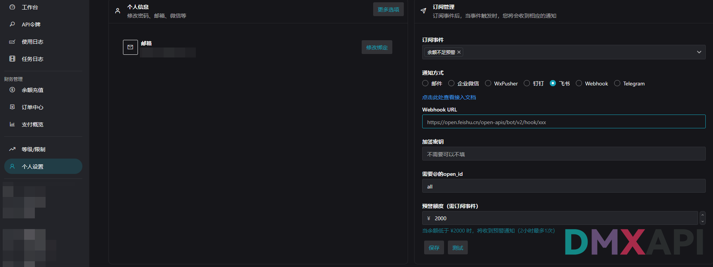

> 可看到飞书通知方式需要填写 **Webhook URL、加签密钥（可选）、需要 @ 的 open_id、预警额度** 等参数，下文将逐步获取并填入。

---

## 二、在飞书中创建用于接收预警的群聊

打开飞书桌面端，新建一个群聊（例如命名为 `dmxapi测试`），用于专门接收 DMXAPI 推送的预警消息。

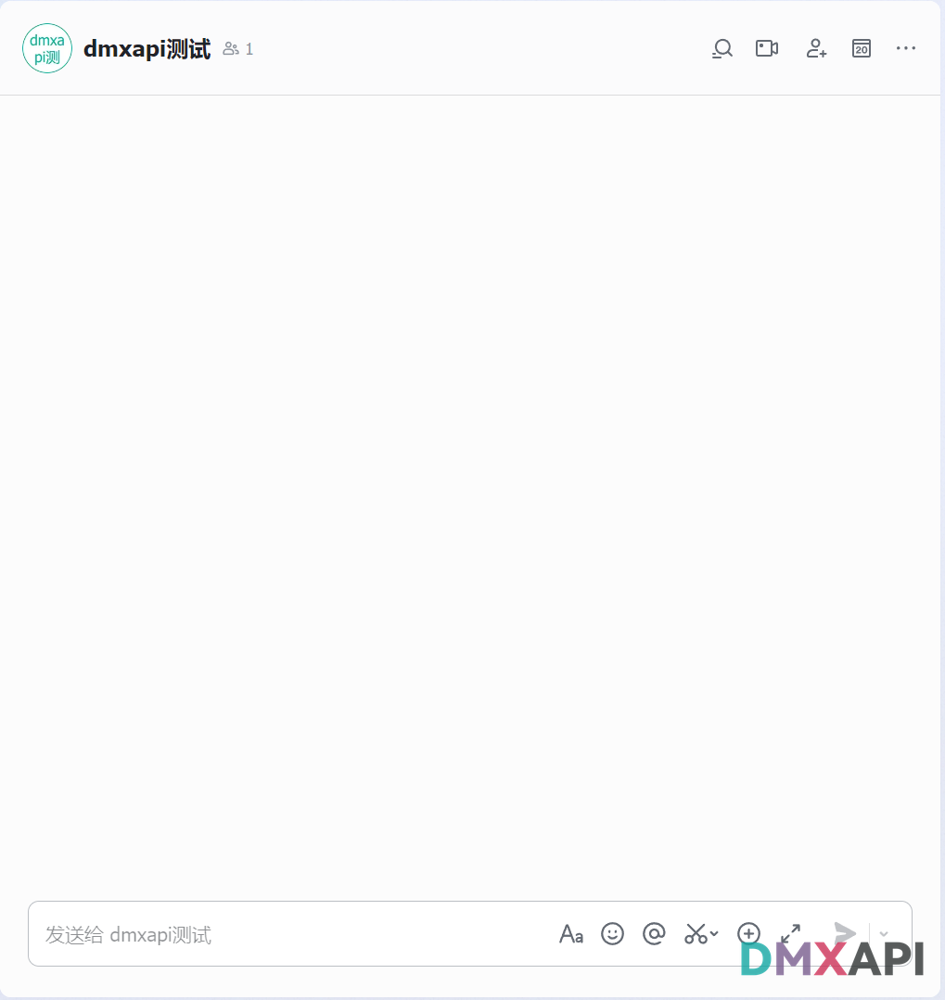

> 建议单独创建一个群组管理预警通知，避免与日常聊天混杂；该群成员可以只有你一人，也可以拉入其他需要接收预警的同事。

---

## 三、进入群设置

在群聊右上角点击 **更多（···）按钮**，在下拉菜单中点击 **设置**。

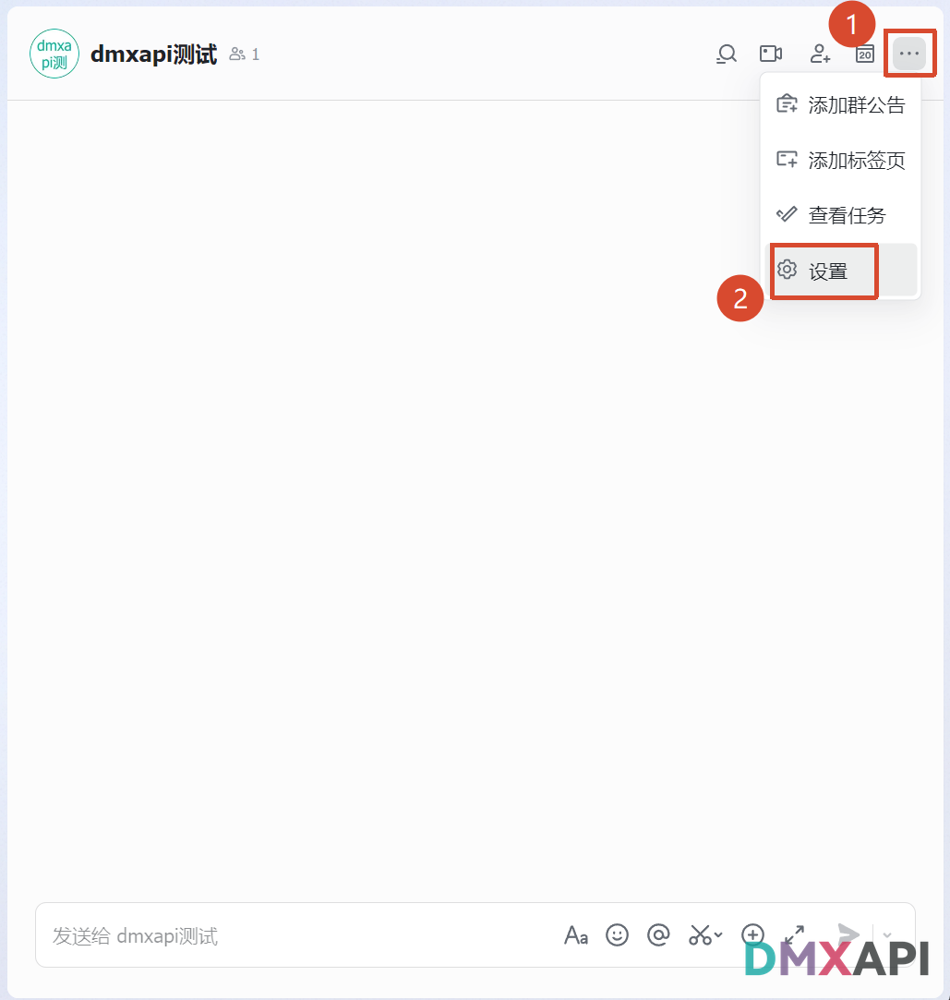

---

## 四、打开"群机器人"管理面板

在右侧弹出的"设置"侧边栏中，找到并点击 **群机器人**。

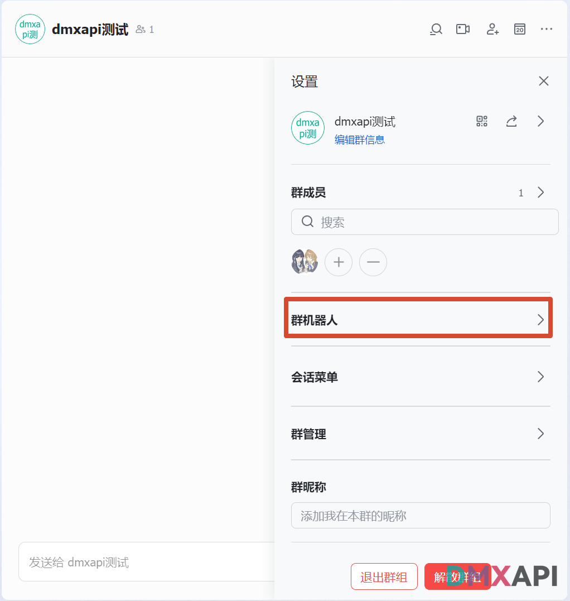

---

## 五、点击"添加机器人"

在群机器人管理界面，点击蓝色的 **添加机器人** 按钮。

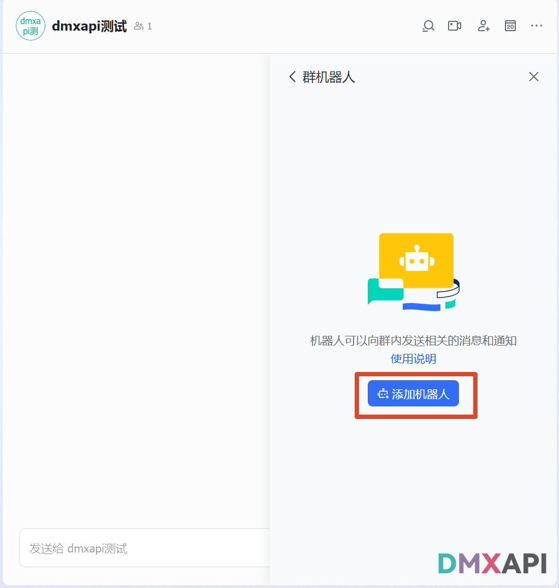

---

## 六、选择"自定义机器人"

在弹出的机器人列表中，选择 **自定义机器人**（通过 Webhook 将外部服务消息推送至飞书）。

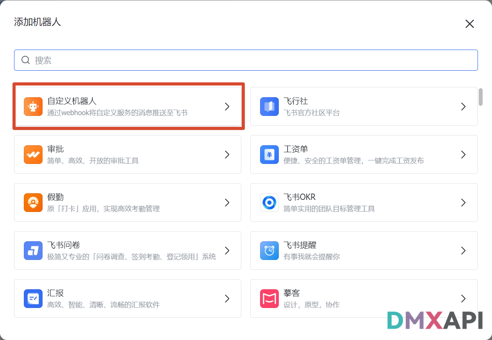

---

## 七、填写机器人名称与描述

为机器人填写以下信息：

- **机器人头像**：使用默认头像（可任选颜色）。
- **机器人名称**：例如 `dmxapi测试`，用于在群中识别预警来源。
- **描述**：例如 `通过webhook将自定义服务的消息推送至飞书`。

填写完成后，点击右下角 **添加** 按钮。

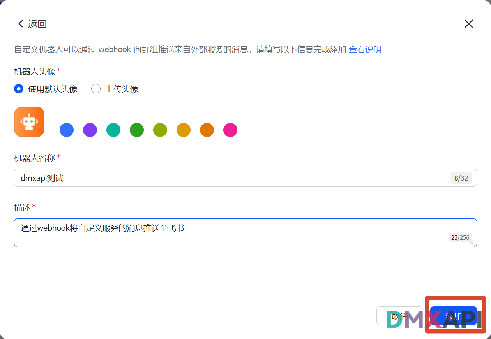

---

## 八、复制 Webhook 地址

机器人添加成功后，飞书会生成一个唯一的 **Webhook 地址**，形如：

```
https://open.feishu.cn/open-apis/bot/v2/hook/xxxxxxxx-xxxx-xxxx-xxxx-xxxxxxxxxxxx
```

点击地址右侧的 **复制** 按钮，将其保存到剪贴板。

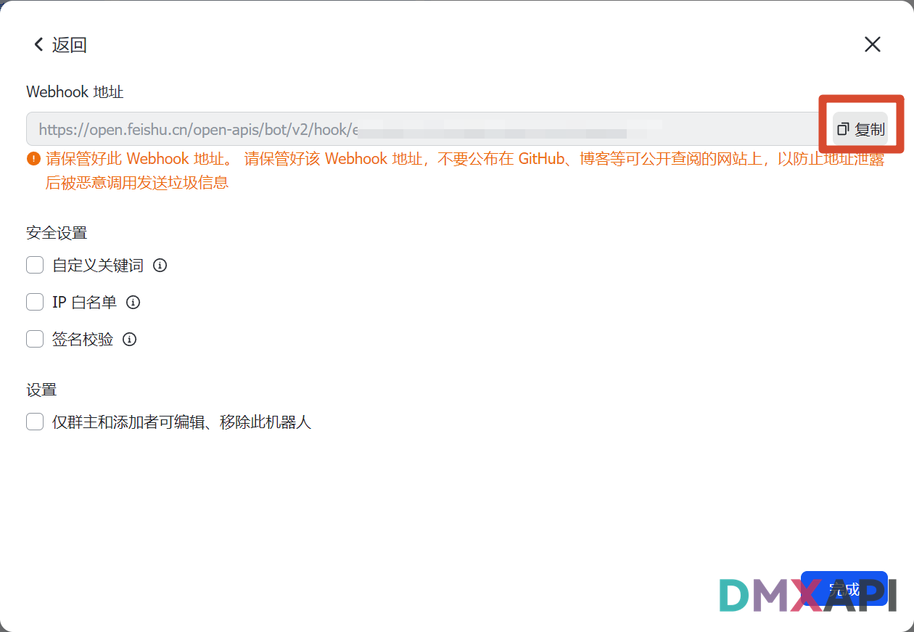

:::warning ⚠️ 安全提醒
该 Webhook 地址相当于一把钥匙，请妥善保管，**严禁公开发布在 GitHub、博客、聊天截图等任何公开渠道**，否则可能被他人恶意滥用。
:::


完成配置后，点击右下角 **完成** 按钮。

---

## 九、回到 DMXAPI 后台填写参数

返回 DMXAPI 的 **个人设置 → 订阅管理** 页面，按下图依次填写并操作：

1. **Webhook URL**：粘贴上一步复制的飞书 Webhook 地址。
2. **加签密钥**：若飞书机器人未启用签名校验则留空；若启用了，填入对应密钥。
3. **需要 @ 的 open_id**：填入 `all` 表示 @所有人；如需 @ 指定成员，填写 open_id，多个用英文逗号分隔。
4. **预警额度**：填入触发预警的金额阈值（如 `2000`，表示余额低于 ¥2000 时触发）。
5. 点击 **保存** 按钮保存配置。
6. 点击 **测试** 按钮，向飞书群推送一条测试消息以验证配置。

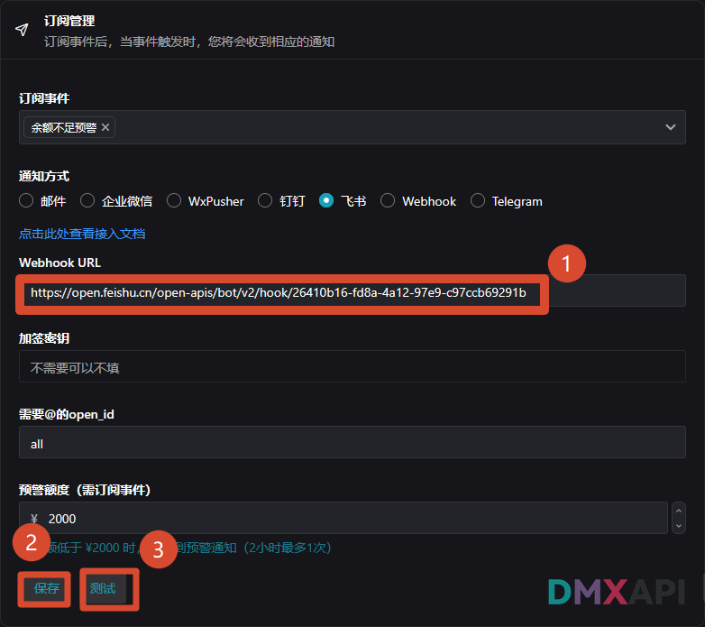

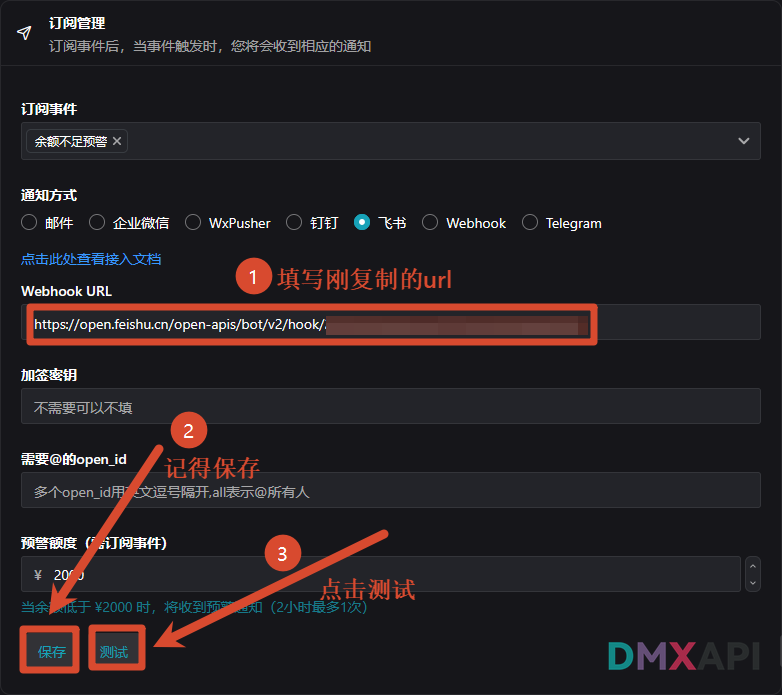

---

## 十、验证测试消息

返回飞书群聊，若配置成功，将收到由 `dmxapi测试` 机器人发送的测试消息，内容类似：

> This is a test notification @所有人

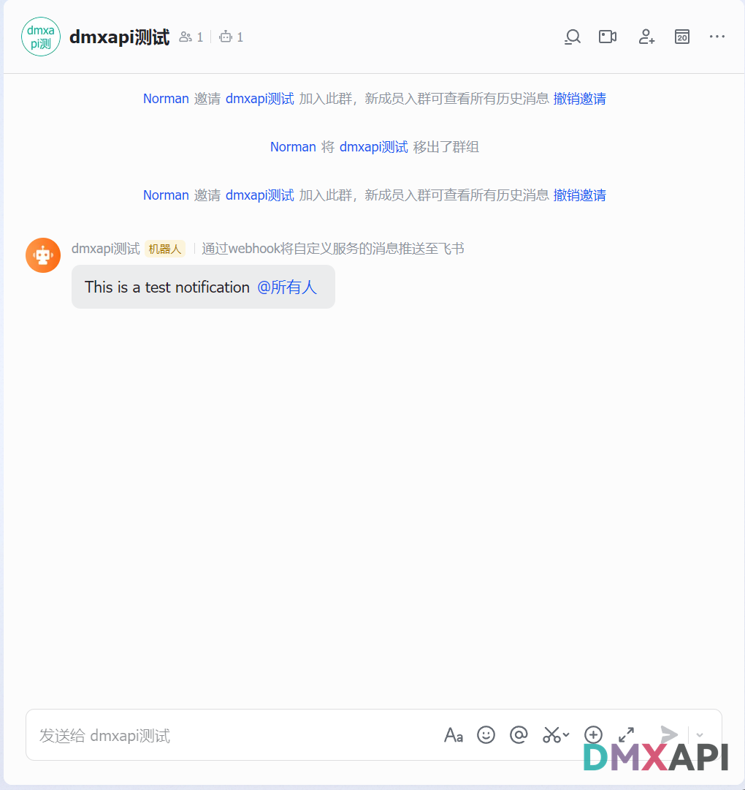

收到该消息即代表 Webhook 配置已生效，今后当账户余额低于设定阈值时，DMXAPI 将自动通过该机器人向群聊推送预警通知。


<p align="center">
  <small>© 2026 DMXAPI 余额不足预警 · 飞书通知配置</small>
</p>
