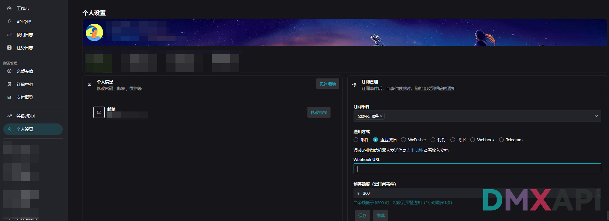
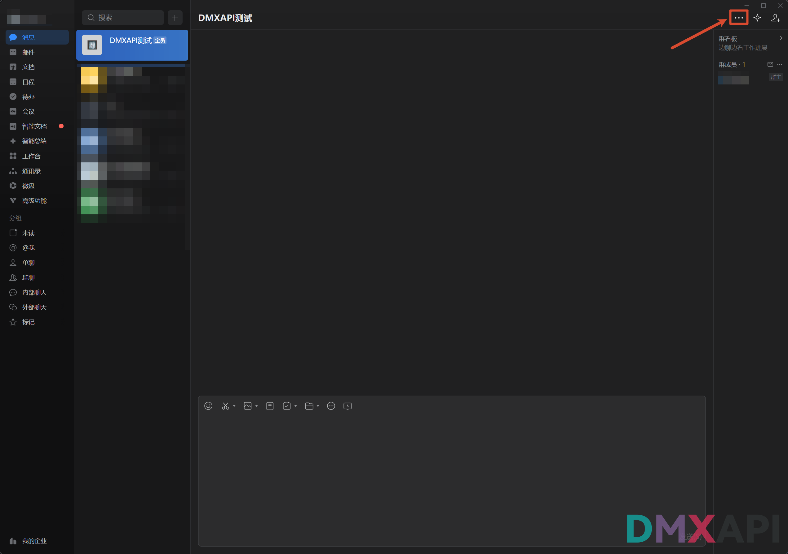
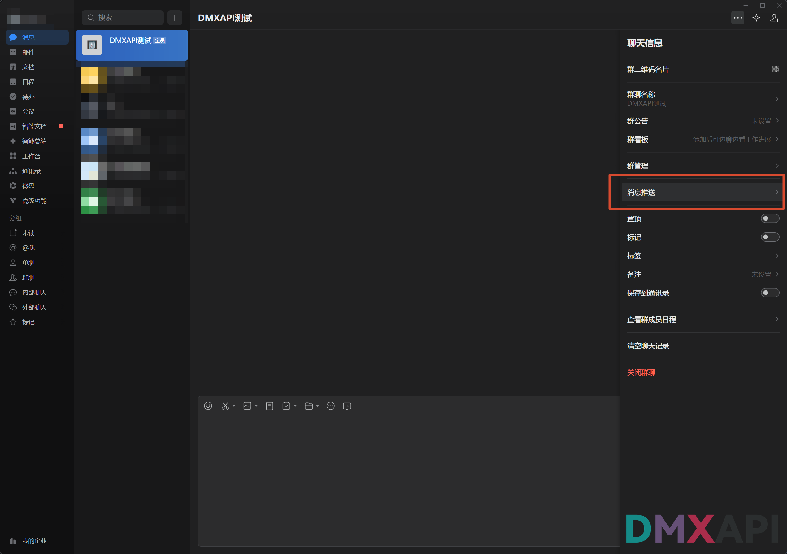
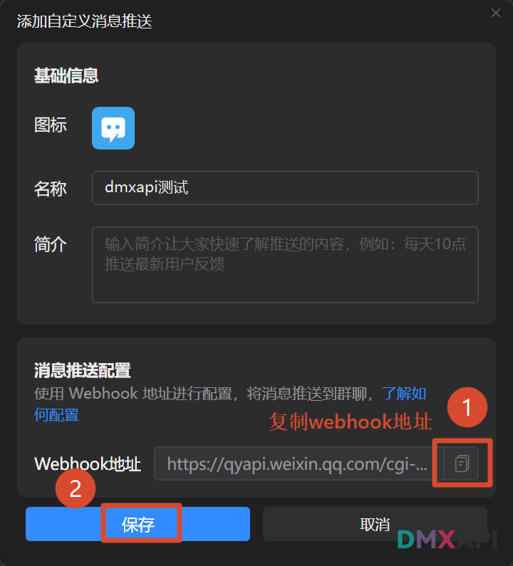
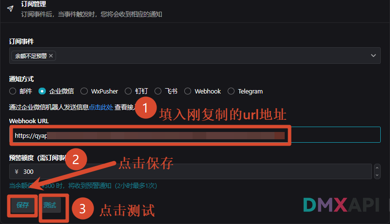
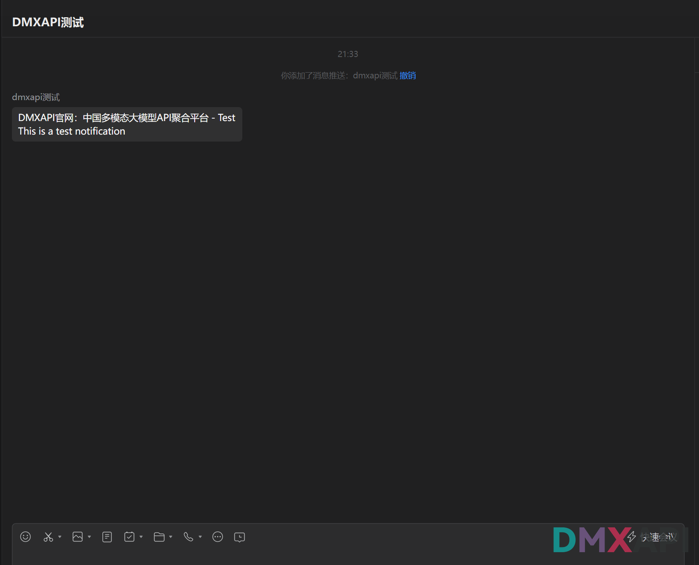

# DMXAPI 余额不足预警 — 企业微信通知配置

当 DMXAPI 账户余额低于设定阈值时，可通过企业微信群机器人自动推送预警消息到指定群聊，避免因余额耗尽导致服务中断。本文演示从在企业微信中创建群机器人、获取 Webhook 地址，到在 DMXAPI 后台完成订阅配置并测试的完整流程。


## 一、在 DMXAPI 后台进入订阅管理

登录 [DMXAPI](https://www.dmxapi.cn/) 后，依次进入 **个人设置 → 订阅管理**：

1. **订阅事件**：选择 `余额不足预警`
2. **通知方式**：选择 `企业微信`



> 选中"企业微信"后，下方会出现 **Webhook URL** 和 **预警额度** 等参数；下文将一步步获取并填入。

---

## 二、在企业微信中打开目标群聊

打开企业微信桌面端，进入用于接收预警的群聊（例如 `DMXAPI测试`）。如果还没有，可以先单独创建一个内部群，避免和日常聊天混杂。

进入群聊后，点击右上角的 **更多（···）按钮**。



---

## 三、进入"消息推送"设置

在右侧弹出的"聊天信息"面板中，找到并点击 **消息推送**。



> 企业微信通过"自定义消息推送/群机器人"来接入外部 Webhook，DMXAPI 的预警消息就是通过这一通道下发到群聊。

---

## 四、添加自定义消息推送

在"消息推送"页面，点击 **添加** 按钮，填写以下信息：

- **图标**：使用默认即可。
- **名称**：例如 `dmxapi测试`，用于在群中识别预警来源。
- **简介**：可选，简单说明用途（如"DMXAPI 余额预警通知"）。
- **Webhook 地址**：企业微信会自动生成，形如：

  ```
  https://qyapi.weixin.qq.com/cgi-bin/webhook/send?key=xxxxxxxx-xxxx-xxxx-xxxx-xxxxxxxxxxxx
  ```

填写完成后：

1. 点击 Webhook 地址右侧的 **复制图标**，把地址保存到剪贴板。
2. 点击左下角的 **保存** 按钮，完成机器人创建。



:::warning ⚠️ 安全提醒
该 Webhook 地址相当于一把钥匙，请妥善保管，**严禁公开发布在 GitHub、博客、聊天截图等任何公开渠道**，否则可能被他人恶意滥用。
:::

---

## 五、回到 DMXAPI 后台填写参数

返回 DMXAPI 的 **个人设置 → 订阅管理** 页面，按下图依次填写并操作：

1. **Webhook URL**：粘贴上一步复制的企业微信 Webhook 地址。
2. **预警额度**：填入触发预警的金额阈值（如 `300`，表示余额低于 ¥300 时触发）。
3. 点击 **保存** 按钮保存配置。
4. 点击 **测试** 按钮，向企业微信群推送一条测试消息以验证配置。



---

## 六、验证测试消息

返回企业微信群聊，若配置成功，将收到由 `dmxapi测试` 机器人发送的测试消息，内容类似：

> **DMXAPI官网：中国多模态大模型API聚合平台 - Test**
> This is a test notification



收到该消息即代表 Webhook 配置已生效。今后当账户余额低于设定阈值时，DMXAPI 将自动通过该机器人向群聊推送预警通知。


<p align="center">
  <small>© 2026 DMXAPI 余额不足预警 · 企业微信通知配置</small>
</p>
