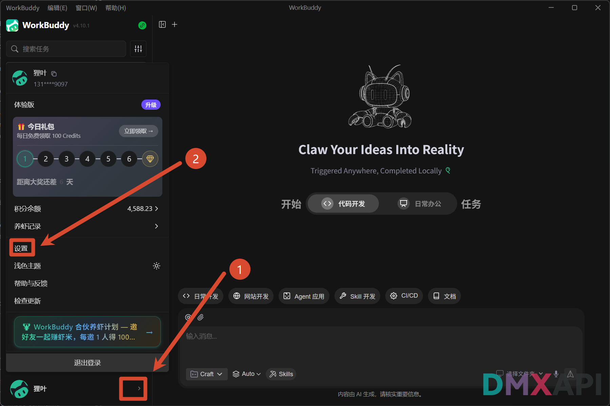
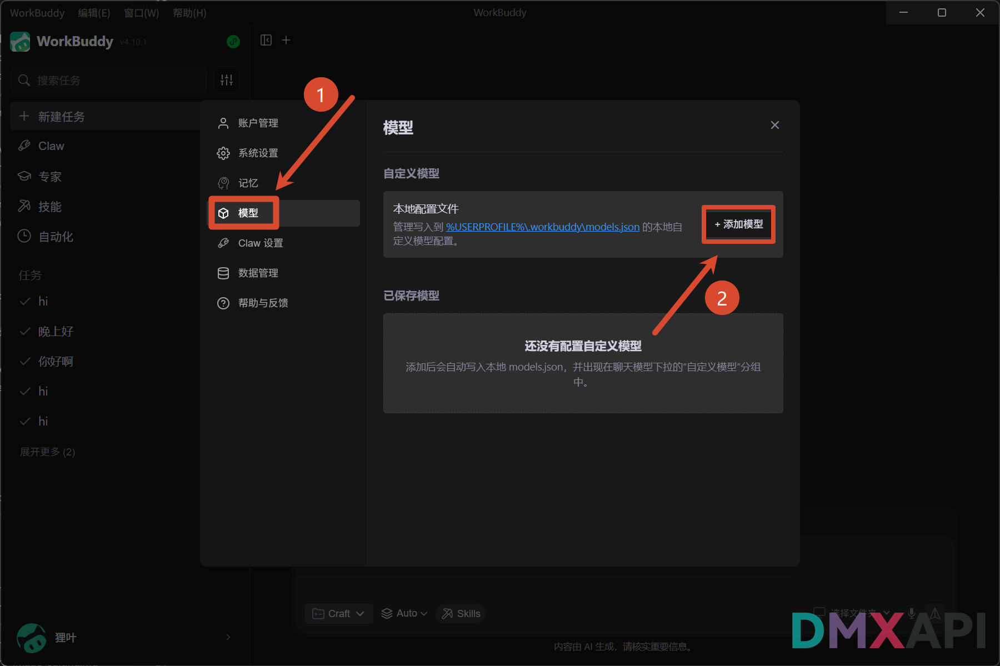
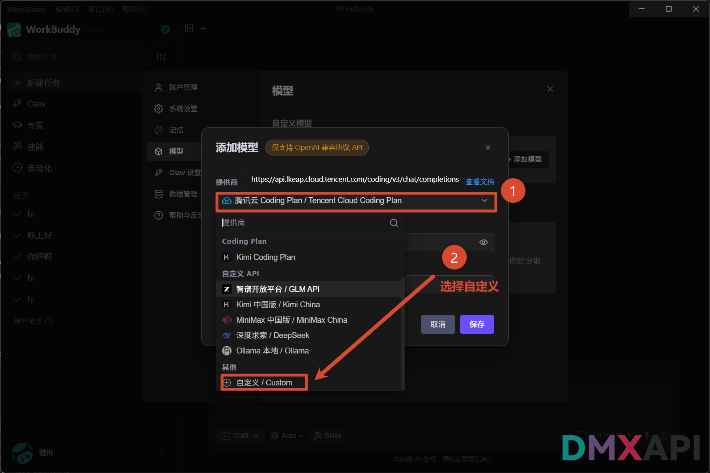
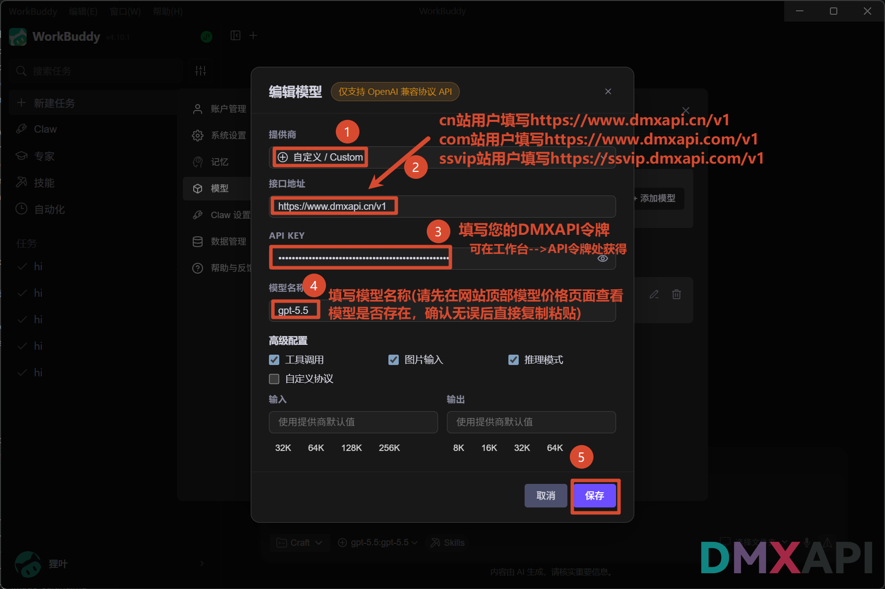
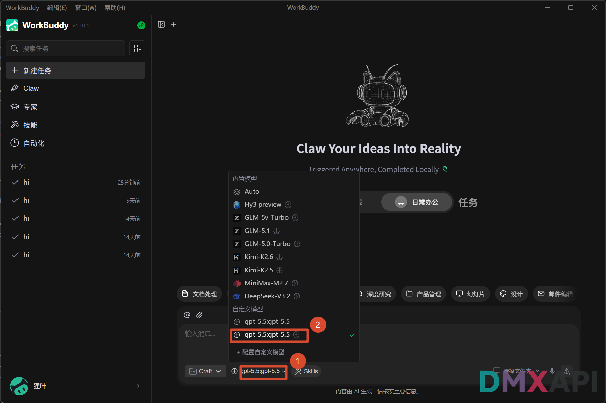
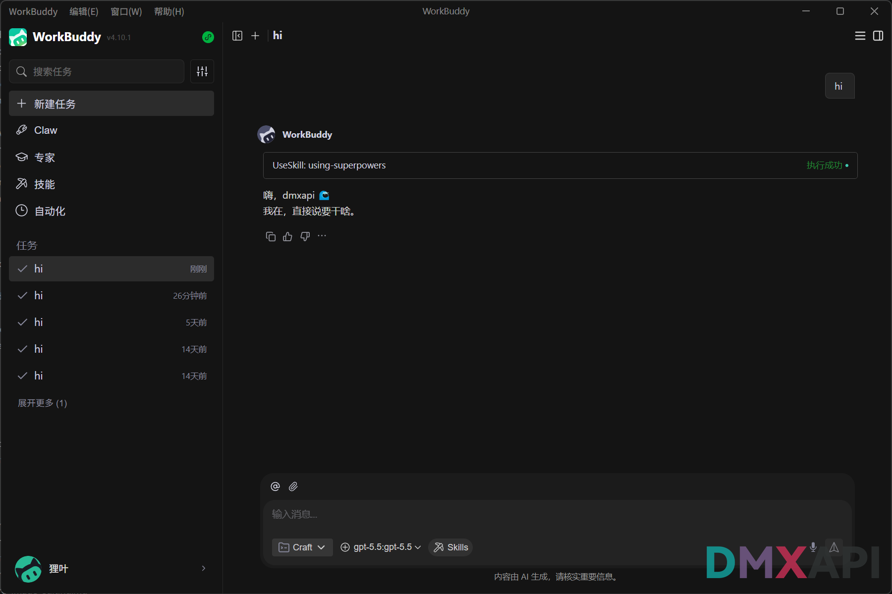
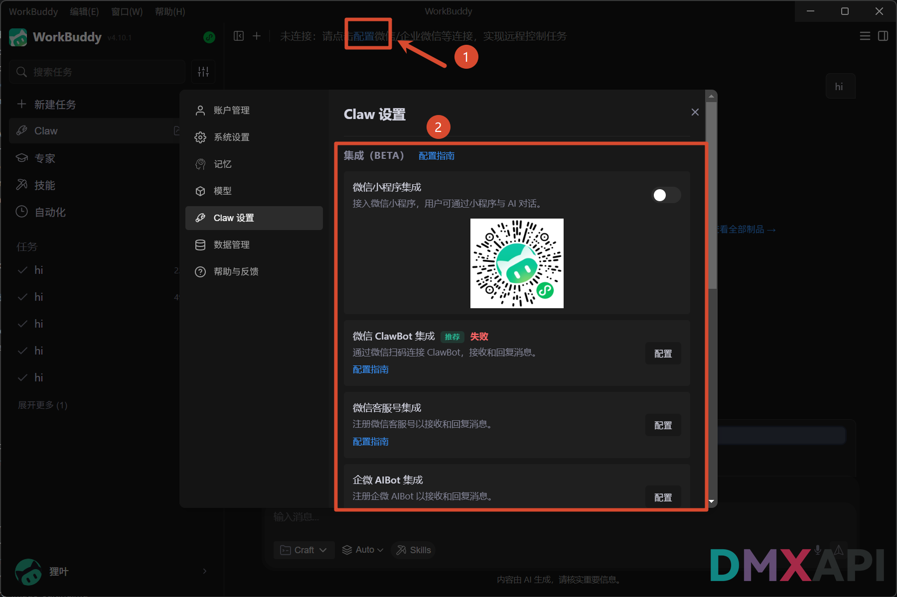

# WorkBuddy 配置 DMXAPI 使用教程

WorkBuddy 是腾讯推出的 AI 桌面智能体，支持自然语言驱动本地任务执行。通过配置 DMXAPI 自定义模型，可以在 WorkBuddy 中接入 GPT、Claude、Gemini 等主流模型，充分发挥其文档处理、数据分析、自动化办公等能力。

## 下载安装

前往 WorkBuddy 官网下载客户端，支持 Windows 和 macOS：

👉 **[https://copilot.tencent.com/work/](https://copilot.tencent.com/work/)**

## 配置 DMXAPI 模型

### 第一步：打开设置

启动 WorkBuddy 后，点击左下角头像区域旁的 「>」 按钮展开侧边菜单，在菜单中点击「设置」进入设置页面。

### 第二步：进入模型管理，点击添加

在设置页左侧导航中点击 ①「模型」标签，页面右侧会显示已保存的自定义模型列表。点击右上角 ②「+ 添加模型」按钮开始添加新模型。

### 第三步：选择自定义提供商

在弹出的「添加模型」对话框中，点击 ① 提供商下拉菜单展开供应商列表，滑动到列表底部「其他」分类，选择 ②「自定义 / Custom」。

### 第四步：填写 DMXAPI 配置信息

选择自定义后，按下图填写三项关键配置信息，完成后点击「保存」：

## 选择模型并测试

### 第五步：切换到自定义模型

回到 WorkBuddy 主界面，点击底部输入框左侧的 ① 模型选择器（默认显示当前使用的模型名），在弹出的下拉列表中找到「自定义模型」分组，选择 ② 刚才添加的模型即可切换生效。

### 第六步：发送消息测试

在输入框中发送任意内容（如 `hi`），如果 WorkBuddy 正常返回回复，说明 DMXAPI 已成功接入，可以开始使用了。

## 连接手机端（可选）

WorkBuddy 内置 **Claw** 功能，支持将 AI 能力接入微信小程序、微信 ClawBot、微信客服号、企微 AIBot 等渠道，实现用手机远程触发、控制电脑执行任务。

点击顶部工具栏右侧的 ① 齿轮图标，进入「Claw 设置」，在 ② 各集成入口旁点击「配置指南」，按官方文档完成绑定配置。

  <small>© 2026 DMXAPI WorkBuddy 配置教程</small>

